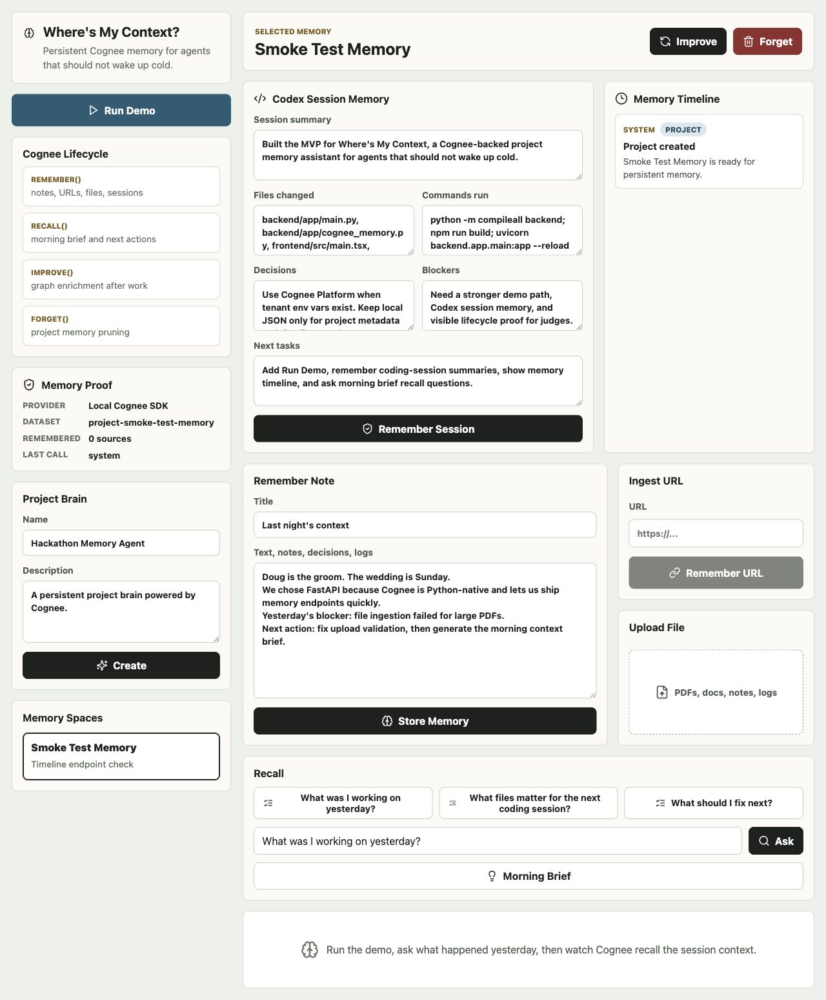

# Where's My Context?

A hackathon MVP for agents that should not wake up with amnesia. The app uses Cognee as a permanent graph-vector memory layer so a project assistant can remember notes, files, URLs, decisions, blockers, and next actions across sessions.

## Why this wins the theme

The product makes Cognee's memory lifecycle the core user workflow:

- `remember()` stores project notes, files, and URLs.
- `recall()` answers questions from the selected project memory.
- `improve()` enriches the project's memory graph after a working session.
- `forget()` prunes the selected project dataset.

## Submission pitch

Agents and LLM tools wake up stateless. **Where's My Context?** gives them a persistent project brain, so a coding agent can remember yesterday's files, commands, decisions, blockers, and next tasks before starting the next session.

Cognee is central because the app does not just save local notes:

- every project gets a Cognee-scoped dataset;
- every note, URL, file, and Codex-style session enters Cognee through `remember()`;
- answers and morning briefs come back through Cognee `recall()`;
- the timeline makes the memory lifecycle visible for judges.

## Demo-ready features

- One-click **Run Demo** path for judges.
- Codex-style coding session memory for files changed, commands run, decisions, blockers, and next tasks.
- Memory timeline that shows the Cognee lifecycle calls made for the selected project.
- Source labels for remembered notes, URLs, files, coding sessions, and recall answers.
- Morning brief recall that asks Cognee for yesterday's decisions, blockers, files that matter, and next actions.
- Memory Proof panel showing provider mode, dataset name, remembered source count, and latest lifecycle call.

## Screenshot



## Cognee lifecycle mapping

| Product action | Cognee lifecycle | Backend route |
| --- | --- | --- |
| Remember note, URL, file, or session | `remember()` | `/memory/remember/*` |
| Ask a question or morning brief | `recall()` | `/memory/recall` |
| Enrich project memory after work | `improve()` / `cognify` | `/memory/improve` |
| Prune selected project memory | `forget()` | `/memory/forget` |

## App flow

1. Create a project memory space.
2. Paste context from yesterday, upload a file, ingest a URL, or remember a Codex coding session.
3. Ask questions like "What was I working on yesterday?" or "What files matter?"
4. Generate a morning brief from remembered decisions, blockers, files, and next actions.
5. Improve or forget the selected project memory when needed.

## Demo script

1. Start the backend and frontend.
2. Open `http://127.0.0.1:5173`.
3. Click **Run Demo**.
4. Show the lifecycle rail and Memory Timeline as the app stores a coding session, improves the memory graph, and asks judge-ready recall questions.
5. Click **Morning Brief** to prove the agent can wake up with yesterday's project context.
6. Optionally click **Forget** to show memory pruning for the selected project dataset.

## Setup

```powershell
python -m venv .venv
.\.venv\Scripts\Activate.ps1
python -m pip install -r backend\requirements.txt
Copy-Item .env.example .env
```

Fill `.env` with Cognee Platform variables:

```powershell
COGNEE_API_BASE_URL=https://tenant-xxxx.aws.cognee.ai
COGNEE_API_KEY=your-platform-key
COGNEE_TENANT_ID=your-tenant-id
```

`.env` is ignored by git. Do not put the API key in frontend code.

If an API key was ever shared in chat, screenshots, or a recording, rotate it before submitting publicly.

Install frontend dependencies:

```powershell
cd frontend
npm install
```

## Run

Backend:

```powershell
.\.venv\Scripts\Activate.ps1
python -m uvicorn backend.app.main:app --reload --host 127.0.0.1 --port 8000
```

Frontend:

```powershell
cd frontend
npm run dev
```

Open `http://127.0.0.1:5173`.

## 3-day build plan

### Day 1: Working memory loop

- Backend endpoints for `remember`, `recall`, `improve`, and `forget`.
- Project-scoped datasets.
- Frontend controls for notes, URLs, files, recall chat, morning brief, improve, and forget.

### Day 2: Better demo and retrieval

- Add sample project memories and one-click demo seed.
- Add memory timeline and source labels.
- Improve file and URL ingestion UX.
- Tune prompts for morning brief and decision recovery.

### Day 3: Hackathon polish

- Record a short demo: cold start, remember, recall next action, improve, forget.
- Add deployment docs.
- Create submission screenshots.
- Tighten README and pitch.
